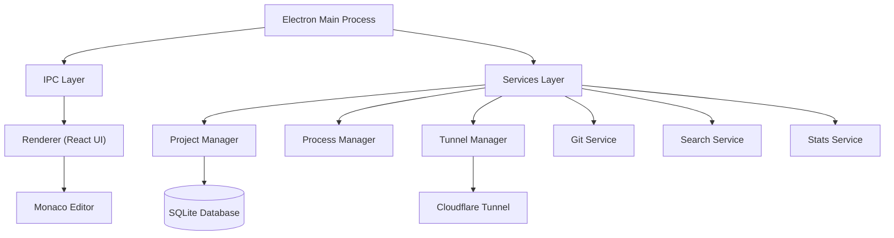
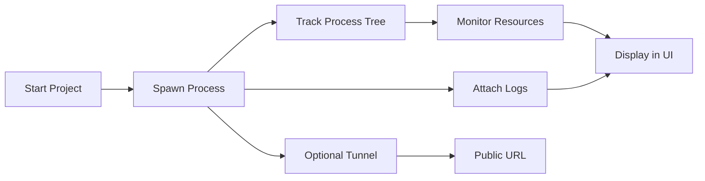

# SelfHost Helper

## Run projects • Monitor resources • Edit code • Expose services

Your entire local development environment — in one desktop app.

SelfHost Helper brings process management, monitoring, editing, and tunneling into a single workspace. Stop juggling scattered terminal windows and tools; start managing your projects with professional precision.

---

## Demo Showcase


> Built for developers who want control without chaos.

---

## Why this exists

Modern development workflows are fragmented. Most developers have to juggle:

- **Terminal windows** for running processes.
- **System monitors** for tracking resources.
- **Git tools** and editors for quick changes.
- **Tunneling services** to share their work.

SelfHost Helper eliminates that fragmentation, bringing everything into a single high-performance cockpit.

---

## Who is this for

- **Developers** managing multiple local projects.
- **Full-stack engineers** juggling frontend + backend services.
- **Developers** tired of constantly switching between terminal, editor, and monitoring tools.

---

## Preview

### Main Dashboard

The entry point for all your projects, organized by custom categories.


### The Cockpit (Overview Hub)

A customizable workspace for each project featuring a draggable grid of live metric tiles.


### Integrated Editor & Git

VS Code–powered Monaco editor with built-in search and version control.


### Resource Monitoring

Deep-dive into resource history with live charts and per-process tracking.


### Tunnel Management

Instant public exposure for local services via Cloudflare.


---

## What this replaces

SelfHost Helper replaces scattered utilities with a centralized workflow:

- **Centralize** your process lifecycle (Start, Stop, Monitoring).
- **Customize** your workspace with a draggable widget-based Overview Hub.
- **Expose** local services instantly without complex firewall configuration.
- **Consolidate** your coding, terminal, and git workflow into one window.

---

## Core Features

### Home Dashboard (Project Manager)

Organize your development life with custom **Categories**. Use the sidebar to quickly switch between backend APIs, frontend apps, or microservices with drag-and-drop reordering.

### Project Overview (The Cockpit)

The heart of your workspace is a customizable **Overview Hub**. Drag and resize smart tiles to build your ideal monitoring center:

- **Metrics Tiles**: Live CPU and RAM usage with mini sparkline charts for instant telemetry.
- **Mini Console**: Send standard input and view logs directly from the cockpit.
- **Quick Tunnel**: Toggle Cloudflare tunnels and copy public URLs in one click.
- **File Preview**: A high-level view of your project structure for lightning-fast navigation.
- **Process Tracker**: Real-time PID tracking and process health diagnostics.

### Integrated Code Editor (Dev Suite)

A full-featured environment powered by **Monaco** (the engine behind VS Code):

- **Integrated Git tools**: Status, staging, and commits without leaving the app.
- **Blazing Search**: Full-text ripgrep integration for instant result counts across projects.
- **File System**: Robust create/delete/rename operations with native performance.

### Tunneling & Exposure

Securely expose local services to the global internet. Features include quick (unauthenticated) tunnels, credential-based tunnels, and auto-start options to keep your services alive.

---

## Architecture



---

## How it works



---

## Getting Started

### Prerequisites

- Node.js (LTS recommended)
- npm

### Install

```bash
git clone https://github.com/DevRoots-Studio/SelfHost-Helper
cd SelfHost-Helper
npm install
```

### Run

```bash
npm run dev
```

### Build

```bash
npm run build
```

---

## Tech Stack (Why it matters)

- **Electron** — Full native desktop integration and system-level process control.
- **React** — High-performance, reactive UI for real-time telemetry updates.
- **Vite** — Blazing fast build pipeline and rapid development cycle.
- **SQLite + Sequelize** — Reliable local storage with a robust ORM for data integrity.
- **Tailwind CSS** — Modern, utility-first styling for a premium glassmorphic aesthetic.
- **Monaco Editor** — Bringing the power of VS Code directly into your workspace.
- **Cloudflare Tunnels** — Industrial-grade local-to-public tunneling without port forwarding.

---

## Philosophy

> Local development shouldn't feel scattered.

SelfHost Helper brings everything into one place:

- **One interface** to rule them all.
- **One workflow** for all your dev needs.
- **Full control** over your local environment.

---

## Roadmap

Planned features and improvements are tracked in [TODO.md](TODO.md).

---

## Contributing

- Open [issues](https://github.com/DevRoots-Studio/SelfHost-Helper/issues) for bugs or feature ideas.
- Submit [pull requests](https://github.com/DevRoots-Studio/SelfHost-Helper/pulls) to improve the codebase.
- Help improve the ecosystem!

---

## License

ISC License — See [LICENSE](LICENSE) for details.
